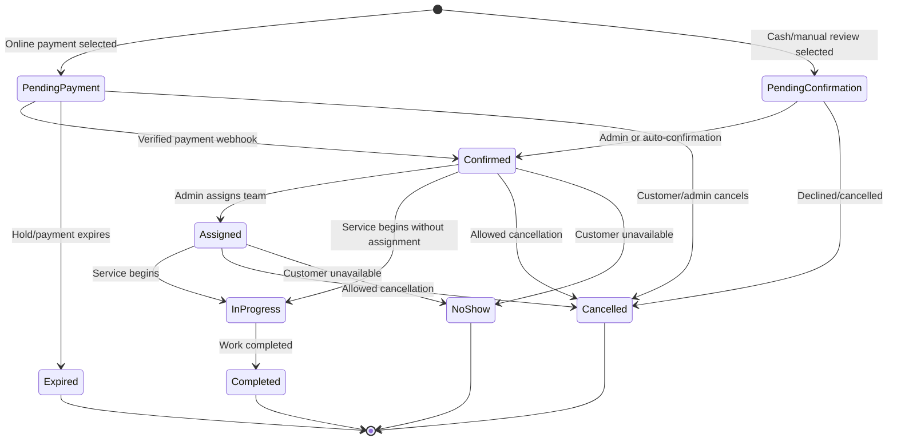
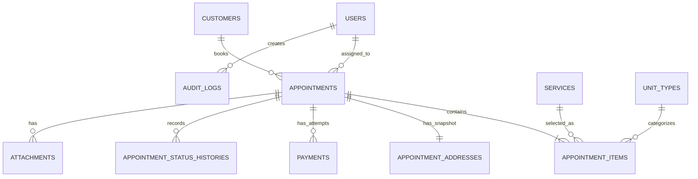

# IcyBreeze Air-Conditioning Cleaning Appointment System

## MVP Product and Technical Blueprint

**Document status:** Proposed MVP, ready for business-rule confirmation  
**Prepared:** August 17, 2026  
**Product type:** Responsive customer website and secure admin web application  
**Primary market assumption:** Philippines, Philippine Peso (PHP), Asia/Manila time zone  

---

## 1. Product vision

IcyBreeze will let customers learn about air-conditioning cleaning services, see transparent pricing, choose an available appointment, provide the service address, select a payment method, and receive confirmation without calling or messaging the business manually.

The admin dashboard will give the business one source of truth for appointments, customers, service details, schedules, payments, and operational status.

### MVP success outcome

A customer can complete a valid booking in a few minutes, while the admin can manage the booking from creation through payment and service completion without using a separate spreadsheet.

### MVP goals

1. Reduce manual appointment coordination.
2. Prevent double-booking and invalid time selections.
3. Give customers clear services, prices, availability, and confirmation.
4. Give the admin a daily and calendar-based operational view.
5. Record payment status and transaction history reliably.
6. Create a secure base that can later support technician accounts, multiple branches, subscriptions, and a mobile app.

### Not included in the first MVP

- Native Android or iOS applications.
- Multi-branch inventory or franchise management.
- Technician mobile accounts, GPS tracking, and route optimization.
- Marketplace-style bidding or multiple service providers.
- Customer loyalty points, memberships, coupons, or subscriptions.
- Automatic payroll, commissions, accounting-system integration, or inventory control.
- AI quotation, chatbots, or automatic photo inspection.
- Complex recurring bookings.

These items can be added after the booking and operations workflow is proven.

---

## 2. Users and access

### 2.1 Visitor / customer

The customer can:

- Browse the public website without signing in.
- View services, supported air-conditioner types, starting prices, service inclusions, and FAQs.
- Check service-area eligibility.
- Select one or more air-conditioning units for cleaning.
- Choose an available date and time.
- Enter contact and service-address information.
- Add access instructions, notes, and optional reference photos.
- Review the computed estimate.
- Choose online payment or cash on service, if enabled.
- Receive a booking reference and secure management link.
- View the booking, payment status, and instructions using the secure link.
- Request cancellation or rescheduling within the configured policy.

**MVP decision:** Customer registration is not required. Guest checkout reduces booking friction. A secure, expiring or revocable management token gives the customer access to one booking. Full customer accounts can be added later without changing the appointment records.

### 2.2 Administrator

The admin can:

- Sign in through a protected admin login.
- View operational and revenue summaries.
- View appointments by calendar or list.
- Search and filter appointments.
- Create phone or walk-in bookings for customers.
- Confirm, assign, reschedule, start, complete, cancel, or mark no-show appointments.
- Add internal notes without exposing them to the customer.
- View and update payment records using controlled actions.
- Maintain services, prices, duration rules, service areas, working hours, slot capacity, and blocked dates.
- View customer history.
- Export basic appointment and payment reports to CSV.
- Review appointment and payment activity history.

### 2.3 Future roles

The schema should allow `scheduler`, `cashier`, and `technician` roles later, but the MVP only needs the `admin` role. Authorization must still use Laravel policies so additional roles do not require a rewrite.

---

## 3. Customer-facing website

### 3.1 Sitemap

| Page | Purpose | MVP content |
|---|---|---|
| Home | Introduce IcyBreeze and drive booking | Hero, key benefits, featured services, how it works, testimonials placeholder/content, coverage, primary Book Now action |
| Services | Explain available services | Service cards, inclusions, estimated duration, starting price, supported unit types |
| Service detail | Help the customer select correctly | Full inclusions, exclusions, preparation instructions, price rules, FAQs, Book This Service action |
| How It Works | Set expectations | Book, confirm/pay, technician visit, service completion |
| About | Build trust | Business story, team or certifications, service promise |
| Coverage | Check location eligibility | Supported cities/areas and possible travel surcharge |
| FAQ | Reduce support questions | Pricing, duration, preparation, payment, cancellation, safety |
| Contact | Give alternate contact options | Phone, email, business hours, social links, inquiry form |
| Terms and Privacy | Legal and data information | Booking terms, cancellation policy, privacy notice |
| Book Appointment | Complete the conversion flow | Multi-step booking wizard |
| Booking confirmation | Confirm successful submission | Reference, status, payment result, next steps |
| Manage booking | Customer self-service | View details and permitted reschedule/cancel actions |

### 3.2 Global website behavior

- Responsive from small phones to desktop displays.
- Persistent Book Now action in the header; sticky action on mobile where appropriate.
- Clear phone/contact fallback.
- Accessible labels, keyboard interaction, error messages, and sufficient contrast.
- Search-engine-friendly public pages and metadata.
- No availability or price promise until the address, service items, and time are validated.

---

## 4. Booking workflow

### Step 1: Select service and units

The customer selects a service such as standard cleaning or deep cleaning, then enters each unit:

- Air-conditioner type: split, window, cassette, floor-standing, or other enabled type.
- Quantity.
- Capacity/horsepower range when it affects price.
- Optional unit notes.

The system calculates the base amount and expected service duration from active pricing rules.

### Step 2: Confirm service location

Required fields:

- Recipient/customer name.
- Mobile number.
- Email address.
- Address line.
- Barangay.
- City/municipality.
- Province.
- Postal code.
- Landmark and access instructions.

The address must belong to an active service area. The system adds any configured travel fee before showing the final estimate.

### Step 3: Select date and time

The availability engine shows only valid slots based on:

- Business hours.
- Service duration and cleanup/travel buffer.
- Minimum lead time.
- Maximum booking horizon.
- Slot/team capacity.
- Existing active appointments.
- Blocked dates or time periods.
- Service-area restrictions.

Past, full, blocked, or impossible slots must never appear as selectable.

### Step 4: Contact, notes, and optional photos

The customer confirms contact details, adds special instructions, and may attach photos of the unit or installation area. Uploads must be type-checked, size-limited, and stored outside the public application path.

### Step 5: Review and payment choice

The customer sees:

- Service items and quantity.
- Appointment date and time.
- Service address.
- Subtotal, travel fee, discounts if ever enabled, and total.
- Payment choice.
- Cancellation and rescheduling summary.
- Consent checkboxes for booking terms and privacy notice.

### Step 6: Create booking and confirm

The server revalidates price and availability. It then creates the appointment, items, address snapshot, and initial payment record in one database transaction.

- **Cash on service:** appointment becomes `pending_confirmation` or `confirmed`, according to the admin setting.
- **Online payment:** appointment becomes `pending_payment`; the selected slot is held for a configurable period, initially 15 minutes. The customer is redirected to hosted checkout.
- A verified payment webhook marks the payment `paid` and confirms the appointment.
- An expired or failed payment releases the temporary hold unless the customer retries within policy.

### Booking reference

Every appointment receives a human-friendly, non-sequential reference such as `ICY-260817-A7K4`. Internal numeric or UUID identifiers must not be exposed as the sole access control.

---

## 5. Scheduling and conflict rules

### 5.1 MVP scheduling model

Use business-defined working windows and capacity, rather than allowing arbitrary times. Example configuration:

- Monday-Saturday: 8:00 AM-5:00 PM.
- Sunday: closed.
- Minimum lead time: 24 hours.
- Booking horizon: 60 days.
- Base slot interval: 30 minutes.
- Capacity: number of teams that can work concurrently.
- Service duration: calculated from service and unit quantity.
- Buffer: configured travel/cleanup minutes.

These are starting assumptions only and must be admin-configurable.

### 5.2 Double-booking protection

Availability shown in the browser is informative, not final. When the booking is submitted, the backend must:

1. Start a database transaction.
2. Lock the relevant capacity/slot records.
3. Recalculate appointment start, end, capacity, and price.
4. Reject the request if capacity is no longer available.
5. Create the appointment and its hold or confirmation.
6. Commit before dispatching notifications.

This prevents two customers who selected the last opening at the same time from both receiving it.

### 5.3 Appointment lifecycle



Allowed transitions must be enforced in domain code. An admin cannot accidentally move a completed booking back to pending without a separate corrective action and audit record.

---

## 6. Payments

### 6.1 MVP payment methods

1. **Cash on service** — stored as unpaid until the admin records collection.
2. **Online hosted checkout** — recommended Philippine integration: PayMongo Hosted Checkout v2, subject to merchant approval and enabled payment-method capabilities.

Hosted checkout keeps sensitive card details away from the IcyBreeze server. Enabled PayMongo methods may include cards, GCash, QR Ph, Maya, and others depending on the merchant account. The application must display only methods actually enabled for the production merchant.

### 6.2 MVP charging rule

Support two settings in the data model but activate only one business rule at launch:

- Full online payment; or
- Cash on service.

A fixed or percentage deposit can be added in a later release. It should not be enabled until cancellation, refund, and balance-collection rules are agreed.

### 6.3 Payment statuses

- `unpaid`
- `pending`
- `paid`
- `failed`
- `expired`
- `refunded`
- `partially_refunded` (schema-ready, optional UI after MVP)

Appointment status and payment status remain separate. For example, a completed cash appointment can briefly be `completed` and `unpaid` until the cashier records payment.

### 6.4 Payment integrity

- Store money as integer centavos, never floating-point values.
- Generate checkout sessions only on the server.
- Never store card numbers, CVV, or wallet credentials.
- Verify webhook authenticity using the payment provider's documented signature process.
- Save the provider event ID and reject duplicate webhook processing.
- Return a quick response to webhooks and process slow follow-up work through a queue.
- Trust a verified webhook, not the browser redirect, as the final payment result.
- Keep immutable transaction references and a payment activity log.
- Refunds in the MVP are initiated outside or through an explicitly authorized admin flow and then reconciled in the system.

---

## 7. Admin dashboard

### 7.1 Dashboard home

Key cards:

- Appointments today.
- Upcoming confirmed appointments.
- Pending confirmation.
- Pending/failed payments.
- Completed services this month.
- Collected revenue this month.

Operational panels:

- Today's chronological schedule.
- New booking alerts.
- Appointments requiring attention.
- Recent payments.

### 7.2 Appointment calendar

- Month, week, and day views.
- Status colors with text labels; color must not be the only signal.
- Filter by status, service, payment status, service area, and assigned team.
- Open an appointment detail drawer/page from the calendar.
- Reschedule through a form with live conflict checking; drag-and-drop can wait until after MVP.

### 7.3 Appointment list and detail

List columns:

- Reference.
- Date/time.
- Customer.
- Service and unit count.
- Area.
- Appointment status.
- Payment status.
- Total.
- Assigned team.

Detail view:

- Customer and address snapshot.
- Service items and pricing snapshot.
- Timeline and current status.
- Payment transactions and references.
- Customer-visible notes and internal notes.
- Attachments.
- Status actions permitted from the current state.
- Reschedule, cancellation, and notification actions.
- Complete audit/activity history.

### 7.4 Customer management

- Search by name, phone, email, or booking reference.
- View contact details, saved-normalized address information, and appointment history.
- Do not merge records automatically on name alone. Phone/email matches may be suggested to an admin.

### 7.5 Service and pricing management

- Create, activate/deactivate, and order services.
- Set customer-facing description and inclusions.
- Configure unit types and price modifiers.
- Configure duration rules and buffers.
- Preview the calculated price before publishing changes.
- Existing appointments keep their price and description snapshots.

### 7.6 Availability and operations settings

- Weekly business hours.
- Minimum lead time and booking horizon.
- Concurrent team/capacity count.
- Blackout dates and partial-day blocks.
- Service areas and travel fees.
- Manual booking outside public availability, requiring a reason and audit entry.

### 7.7 Payments and reports

- Payment list with date, customer, appointment, method, provider reference, status, and amount.
- Record cash collection.
- Reconcile online status using the provider reference.
- Export appointments and payments to CSV for a selected date range.
- Show gross collected revenue only; full accounting and profit reporting are not MVP features.

### 7.8 Settings

- Business name, logo, contact information, address, social links.
- Currency and time zone, fixed to PHP and Asia/Manila at launch unless requirements change.
- Booking rules and cancellation text.
- Notification sender details.
- Online/cash payment toggles.

---

## 8. Notifications

### Customer notifications

- Booking received.
- Payment received.
- Booking confirmed.
- Booking rescheduled.
- Booking cancelled.
- Reminder approximately 24 hours before service.
- Service completed and receipt/summary.

### Admin notifications

- New booking.
- Successful or failed online payment requiring attention.
- Customer reschedule/cancellation request.

### MVP channels

- Email is required.
- In-dashboard notifications are required for the admin.
- SMS is an optional launch enhancement once a provider and message costs are approved.

All email and provider calls should run through queued jobs after the booking transaction commits.

---

## 9. Proposed data model

The following is a logical model. Exact migrations may split or rename fields during implementation.

### `users`

Admin authentication and future internal accounts.

Key fields: `id`, `name`, `email`, `phone`, `password`, `role`, `is_active`, `email_verified_at`, `last_login_at`, timestamps.

### `customers`

Customer identity independent of whether customer login is later added.

Key fields: `id`, nullable `user_id`, `first_name`, `last_name`, `email`, `phone`, `marketing_consent_at`, timestamps.

### `services`

Service catalog.

Key fields: `id`, `name`, `slug`, `short_description`, `description`, `base_price_centavos`, `base_duration_minutes`, `buffer_minutes`, `is_active`, `sort_order`, timestamps.

### `unit_types`

Supported air-conditioner types and modifiers.

Key fields: `id`, `name`, `price_modifier_centavos`, `duration_modifier_minutes`, `is_active`, timestamps.

### `service_areas`

Coverage and travel rules.

Key fields: `id`, `name`, `city`, nullable `barangay`, `postal_code_pattern`, `travel_fee_centavos`, `additional_travel_minutes`, `is_active`, timestamps.

### `appointments`

Main scheduling aggregate.

Key fields: `id` UUID/ULID, `reference`, `customer_id`, nullable `assigned_user_id`, `status`, `payment_status`, `source` (`web` or `admin`), `starts_at`, `ends_at`, `timezone`, `subtotal_centavos`, `travel_fee_centavos`, `discount_centavos`, `total_centavos`, `customer_notes`, `internal_notes`, `terms_accepted_at`, `manage_token_hash`, nullable `hold_expires_at`, nullable `confirmed_at`, nullable `completed_at`, nullable `cancelled_at`, cancellation fields, timestamps.

### `appointment_items`

Immutable booking-line snapshots.

Key fields: `id`, `appointment_id`, `service_id`, `unit_type_id`, `service_name`, `unit_type_name`, `quantity`, `unit_price_centavos`, `duration_minutes`, `line_total_centavos`, `unit_notes`, timestamps.

### `appointment_addresses`

Address snapshot that remains accurate even if customer details later change.

Key fields: `id`, `appointment_id`, `recipient_name`, `phone`, `address_line_1`, nullable `address_line_2`, `barangay`, `city`, `province`, `postal_code`, `landmark`, `access_instructions`, optional coordinates, timestamps.

### `availability_rules`

Weekly operating windows.

Key fields: `id`, `day_of_week`, `opens_at`, `closes_at`, `capacity`, `is_active`, timestamps.

### `schedule_blocks`

Holidays, maintenance, private events, or other unavailable periods.

Key fields: `id`, `starts_at`, `ends_at`, `capacity_reduction`, `reason`, nullable `created_by`, timestamps.

### `payments`

One appointment may have more than one attempt or transaction.

Key fields: `id` UUID/ULID, `appointment_id`, `method`, `provider`, `provider_checkout_id`, `provider_payment_id`, `provider_event_id`, `status`, `amount_centavos`, `currency`, `paid_at`, `failed_at`, `refunded_at`, `failure_code`, safe provider metadata JSON, timestamps.

### `payment_webhook_events`

Webhook idempotency and trace record.

Key fields: `id`, `provider`, `external_event_id` unique, `event_type`, `payload_hash`, `received_at`, `processed_at`, `processing_status`, `error_message`, timestamps.

### `appointment_status_histories`

Immutable appointment timeline.

Key fields: `id`, `appointment_id`, `from_status`, `to_status`, nullable `actor_user_id`, `actor_type`, `reason`, `created_at`.

### `attachments`

Optional customer photos or admin documents.

Key fields: `id`, `appointment_id`, `uploaded_by_type`, `uploaded_by_id`, `disk`, `path`, `original_name`, `mime_type`, `size_bytes`, timestamps.

### `notifications`

Use Laravel's database notification table for admin alerts, plus provider delivery logs if detailed tracking is required.

### `settings`

Typed business settings such as lead time, booking horizon, payment toggles, and cancellation rules. Sensitive secrets remain in environment/secret storage, never this table.

### `audit_logs`

Admin-sensitive changes.

Key fields: `id`, nullable `actor_user_id`, `action`, `auditable_type`, `auditable_id`, sanitized `before` JSON, sanitized `after` JSON, IP/user-agent where appropriate, `created_at`.

### Relationship summary



---

## 10. Laravel technical architecture

### 10.1 Recommended stack

- **Backend:** Laravel 13 modular monolith.
- **Runtime:** PHP 8.3 or newer version supported by Laravel 13.
- **Frontend:** Official Laravel Livewire starter kit, Livewire 4, Blade, Alpine-compatible interactions, Tailwind CSS 4.
- **Database:** MySQL 8+ with strict mode, UTC timestamps in storage, Asia/Manila display conversion.
- **Cache/session/queues:** Redis in production; database queue is acceptable during early local development.
- **Payments:** PayMongo Hosted Checkout v2 behind an application payment-gateway interface.
- **Email:** Laravel mail with a transactional email provider selected before deployment.
- **Storage:** Local private storage during development; S3-compatible private object storage in production.
- **Testing:** Pest or PHPUnit feature and unit tests; one convention should be selected and used consistently.

Laravel 13 is the current major line as of this document. The architecture should stay on first-party framework features where practical: Fortify-based starter authentication, policies, validation, events, queued jobs, notifications, rate limiting, the scheduler, and database transactions.

### 10.2 Architecture style

Use a server-rendered modular monolith. This is simpler to deploy and maintain than a separate API and JavaScript single-page application, while Livewire provides the interactivity needed for the booking wizard, availability picker, filters, and admin calendar.

Business rules must not live only in Livewire components or controllers. Pricing, availability, booking creation, status transitions, and payment reconciliation belong in dedicated action/service classes that can be tested without a browser.

### 10.3 Proposed application structure

```text
app/
├── Actions/
│   ├── Appointments/
│   │   ├── CreateAppointment.php
│   │   ├── ConfirmAppointment.php
│   │   ├── RescheduleAppointment.php
│   │   ├── CancelAppointment.php
│   │   ├── StartAppointment.php
│   │   └── CompleteAppointment.php
│   └── Payments/
│       ├── CreateCheckoutSession.php
│       ├── RecordCashPayment.php
│       └── ReconcilePaymentWebhook.php
├── Contracts/
│   └── Payments/PaymentGateway.php
├── Data/
│   ├── AppointmentData.php
│   └── PriceQuoteData.php
├── Enums/
│   ├── AppointmentStatus.php
│   ├── PaymentMethod.php
│   └── PaymentStatus.php
├── Events/
│   ├── AppointmentCreated.php
│   ├── AppointmentConfirmed.php
│   ├── AppointmentRescheduled.php
│   └── PaymentReceived.php
├── Exceptions/
│   ├── SlotUnavailableException.php
│   └── InvalidStatusTransitionException.php
├── Http/
│   ├── Controllers/
│   │   ├── Public/
│   │   ├── Admin/
│   │   └── Webhooks/PayMongoWebhookController.php
│   ├── Middleware/EnsureAdmin.php
│   └── Requests/
├── Jobs/
│   ├── ExpireAppointmentHold.php
│   └── SendAppointmentReminder.php
├── Listeners/
├── Livewire/
│   ├── Booking/
│   ├── Customer/
│   └── Admin/
├── Models/
├── Notifications/
├── Policies/
├── Providers/
├── Rules/
└── Services/
    ├── AvailabilityService.php
    ├── PricingService.php
    ├── AppointmentStatusService.php
    └── Payments/PayMongoGateway.php

config/
├── appointments.php
├── payments.php
└── services.php

database/
├── factories/
├── migrations/
└── seeders/

resources/
├── css/
├── js/
└── views/
    ├── components/
    ├── layouts/
    ├── pages/
    └── livewire/

routes/
├── web.php
├── admin.php
├── webhooks.php
└── console.php

tests/
├── Feature/
│   ├── Admin/
│   ├── Appointments/
│   ├── Payments/
│   └── PublicSite/
└── Unit/
    ├── Availability/
    ├── Pricing/
    └── StatusTransitions/
```

### 10.4 Route map

#### Public

- `GET /`
- `GET /services`
- `GET /services/{service:slug}`
- `GET /how-it-works`
- `GET /coverage`
- `GET /about`
- `GET /faq`
- `GET /contact`
- `GET /terms`
- `GET /privacy`
- `GET /book`
- `GET /book/confirmation/{reference}`
- `GET /manage-booking/{token}`

The interactive booking wizard can use Livewire actions without exposing a broad public REST API.

#### Webhooks

- `POST /webhooks/paymongo`

This route is CSRF-exempt but protected by provider signature verification, strict validation, rate controls where appropriate, idempotency, and safe logging.

#### Admin

- `GET /admin/login`
- `GET /admin`
- `/admin/appointments`
- `/admin/calendar`
- `/admin/customers`
- `/admin/payments`
- `/admin/services`
- `/admin/availability`
- `/admin/reports`
- `/admin/settings`
- `/admin/audit-log`

All admin routes require authentication, active-account checks, and policy authorization. Two-factor authentication should be enabled for administrators before production launch.

---

## 11. Security and privacy requirements

- Use Laravel authentication, secure session cookies, CSRF protection, password hashing, email verification where appropriate, login throttling, and optional/required admin 2FA.
- Authorize every admin record action using policies; hiding a button is not authorization.
- Validate and normalize all booking data on the server.
- Rate-limit booking submissions, manage-link attempts, contact forms, logins, and checkout-session creation.
- Hash booking management tokens in the database and show the plain token only in the generated URL.
- Use signed/temporary URLs for private attachments.
- Verify upload MIME type, size, and extension; reject executable content.
- Verify payment webhooks and process each provider event once.
- Use database transactions for booking, rescheduling, and payment state changes.
- Keep application secrets only in deployment secret storage/environment variables.
- Redact personal data and provider payloads from routine logs.
- Record high-risk admin changes in an audit trail.
- Use HTTPS everywhere in production.
- Back up the database daily and test restoration before launch.
- Define retention and deletion rules for customer information and attachments.
- Present explicit privacy and booking terms appropriate to the business and applicable Philippine requirements; legal wording should be reviewed by a qualified professional.

---

## 12. Scheduled and queued work

### Queue jobs

- Booking and payment emails.
- Admin new-booking alerts.
- Reminder notifications.
- Optional attachment processing.
- Payment follow-up/reconciliation calls when required.

### Laravel scheduler

- Expire stale unpaid slot holds every few minutes.
- Dispatch reminders for appointments entering the reminder window.
- Flag overdue pending payments or unresolved appointments.
- Prune old queue batches, failed temporary data, and expired tokens according to policy.
- Run optional daily operational summary for the admin.

Jobs triggered inside a database transaction must be dispatched after commit so they never send confirmation for rolled-back data.

---

## 13. Business rules requiring confirmation

The software structure is ready, but these values must be supplied before implementation is considered behaviorally complete:

| Decision | Proposed MVP default |
|---|---|
| Business/brand name | IcyBreeze |
| Market, currency, time zone | Philippines, PHP, Asia/Manila |
| Customer account | Guest booking with secure management link |
| Services at launch | Standard cleaning and deep cleaning |
| Unit types | Split, window, cassette, floor-standing |
| Work days/hours | Monday-Saturday, 8:00 AM-5:00 PM |
| Minimum lead time | 24 hours |
| Booking horizon | 60 days |
| Concurrent capacity | 1 team until the business confirms otherwise |
| Online slot hold | 15 minutes |
| Payment methods | Cash on service plus PayMongo hosted checkout |
| Online charge | Full payment |
| Cash booking confirmation | Automatic confirmation if capacity is valid |
| Rescheduling cutoff | 24 hours before appointment |
| Cancellation cutoff | 24 hours before appointment |
| Reminder timing | 24 hours before appointment |
| Required notification | Email |
| Optional notification | SMS after provider approval |

Prices, duration per unit/type, covered cities/barangays, travel fees, capacity, and cancellation/refund wording cannot be safely invented and must come from the business.

---

## 14. MVP acceptance criteria

The MVP is ready for launch only when all of the following are true:

### Customer experience

- A customer can browse every public page on mobile and desktop.
- A customer can create a valid guest booking for an eligible address.
- Pricing is recalculated and validated by the server.
- Only genuinely available slots can be confirmed.
- Simultaneous attempts cannot overbook the last capacity.
- Cash and online payment paths create correct appointment/payment states.
- Successful payment is recognized from a verified webhook.
- The customer receives a reference and confirmation email.
- The secure link shows only that customer's booking and permitted actions.
- Rescheduling and cancellation respect the configured cutoff.

### Admin operations

- Only authorized administrators can enter the dashboard.
- The dashboard shows accurate current counts and totals.
- Appointments appear in both list and calendar views.
- Admin status actions follow valid transitions and create history records.
- Admin rescheduling cannot create a conflict.
- Admin can maintain services, prices, availability, blocks, and service areas.
- Cash and online payments can be viewed and reconciled.
- CSV exports match the selected date range and filters.
- Sensitive changes appear in the audit log.

### Reliability and security

- Critical booking, payment, authorization, and concurrency tests pass.
- Duplicate payment webhooks do not duplicate payments or notifications.
- Queued notification failures retry without corrupting booking state.
- Rate limits protect public submission and authentication endpoints.
- HTTPS, backups, queue workers, scheduler, logging, and health monitoring are configured in production.
- A database restoration rehearsal succeeds before launch.

---

## 15. Test plan

### Unit tests

- Price calculation by service, unit type, quantity, and travel area.
- Duration and buffer calculation.
- Availability across work hours, blocks, capacity, and time-zone boundaries.
- Every allowed and forbidden appointment transition.
- Payment status mapping from provider events.

### Feature tests

- Complete cash booking.
- Complete online checkout initiation.
- Valid, invalid, and duplicate webhook requests.
- Guest management-link access and token isolation.
- Reschedule and cancel within/outside policy.
- Admin authentication, 2FA, and policy enforcement.
- Service, availability, and service-area administration.
- File upload validation.
- CSV exports.

### Concurrency and failure tests

- Two customers request the final capacity simultaneously.
- Payment succeeds after a customer closes the browser.
- Duplicate and out-of-order webhook events arrive.
- Notification provider is temporarily unavailable.
- Queue worker retries after failure.
- Online hold expires while a customer is inactive.

### Browser checks

- Mobile booking completion.
- Desktop admin workflows.
- Keyboard-only booking flow.
- Validation and provider-error states.
- Major current browsers.

---

## 16. Delivery plan

### Phase 0 — Requirements lock and visual direction

- Confirm business rules in Section 13.
- Collect final services, pricing, duration, coverage, policies, and brand assets.
- Produce three visual directions for the public website and dashboard.
- Select one direction before UI implementation.

### Phase 1 — Foundation

- Create Laravel 13 project with the Livewire starter kit.
- Configure environment, database, authentication, admin protection, CI, formatting, and tests.
- Build migrations, seeders, enums, policies, and initial admin account flow.

### Phase 2 — Catalog, pricing, and availability

- Implement services, unit types, service areas, business hours, blocks, pricing, and slot calculation.
- Build unit and feature tests, including concurrency protection.

### Phase 3 — Public website and booking

- Build approved public pages and responsive navigation.
- Build the multi-step booking wizard, confirmation, and secure management page.
- Add customer and admin booking notifications.

### Phase 4 — Payments

- Implement cash payments.
- Integrate PayMongo hosted checkout in test mode.
- Implement signature verification, webhook idempotency, reconciliation, failure states, and payment tests.

### Phase 5 — Admin operations

- Build dashboard, appointment list/calendar/detail, customers, payments, services, availability, settings, reports, and audit history.

### Phase 6 — Launch readiness

- Accessibility, browser, security, failure, and recovery testing.
- Production configuration, email domain, payment merchant activation, SSL, workers, scheduler, backups, monitoring, and admin training.
- Controlled soft launch followed by production launch.

---

## 17. Future roadmap after the MVP

### Next operational improvements

- Staff/scheduler/cashier permissions.
- Technician accounts and mobile job view.
- Team assignment, technician availability, and route planning.
- SMS reminders and two-way confirmation.
- Deposit, refund, balance, and cancellation-fee automation.
- Customer accounts and repeat-booking shortcuts.
- Before/after photos, completion checklist, and customer signature.
- Printable/service-completion receipt and invoice.

### Growth features

- Multiple branches and service zones.
- Maintenance plans and recurring schedules.
- Promotions and referral codes.
- Customer ratings and reviews.
- Analytics for conversion, repeat customers, utilization, cancellations, and service mix.
- Inventory and parts usage.
- Accounting or CRM integrations.
- Public API or mobile applications.

---

## 18. Official technical references

- [Laravel 13 documentation](https://laravel.com/docs/13.x/documentation)
- [Laravel 13 starter kits](https://laravel.com/docs/13.x/starter-kits)
- [Laravel 13 queues](https://laravel.com/docs/13.x/queues)
- [Laravel 13 rate limiting](https://laravel.com/docs/13.x/rate-limiting)
- [PayMongo Hosted Checkout](https://docs.paymongo.com/docs/payment-channels-hosted-checkout)
- [PayMongo account payment capabilities](https://docs.paymongo.com/docs/account-settings-account-capabilities)

---

## 19. Recommended MVP decision

Proceed with a Laravel 13 + Livewire modular monolith, guest booking, one location, capacity-based appointment slots, admin-managed operations, cash on service, and PayMongo hosted checkout. Keep technician login, multi-branch behavior, deposits, and customer accounts out of the first release while preserving clear extension points in the schema and authorization design.
